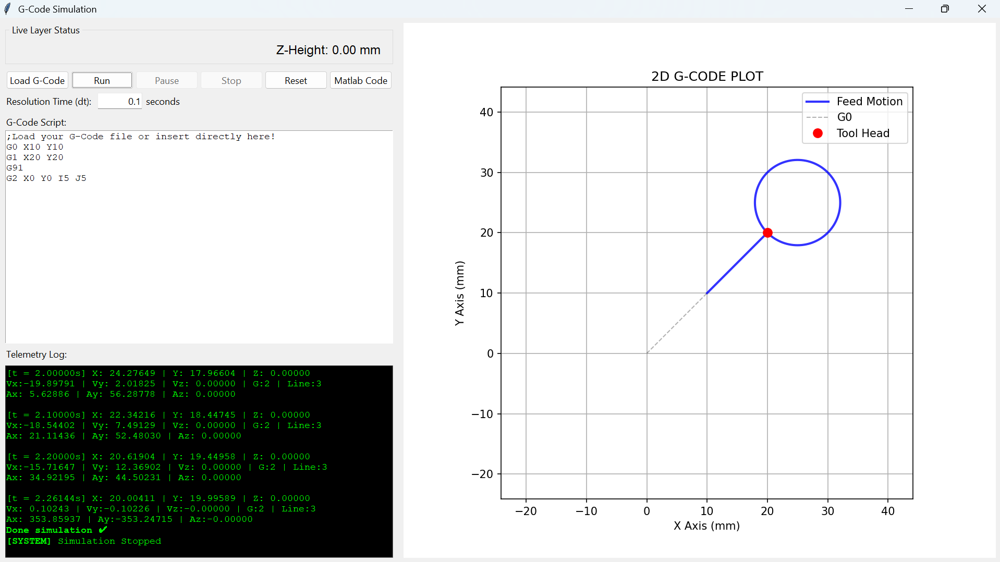

# G-Code Simulator & Motion Trajectory Visualizer

[]()
[]()
[]()
[]()

A lightweight, interactive **G-Code Simulation and Trajectory Visualizer** developed as a sub-module for the Mini CNC Machine project at **Ho Chi Minh City University of Technology (HCMUT)**. 

This software parses standard motion G-code commands, computes real-time toolhead kinematics, displays visual toolpaths, and outputs real-time motion telemetry.

---

## Interface Overview



---

## Key Features & Capabilities

### 1. Motion Command Parsing
* **Linear Interpolation:**
  * `G0`: Rapid positioning (non-cutting motion, represented as dashed gray paths).
  * `G1`: Linear cutting motion (represented as solid blue paths).
* **Circular Interpolation:**
  * `G2`: Clockwise (CW) circular arc interpolation using arc center offset vectors (`I`, `J`).
  * `G3`: Counter-clockwise (CCW) circular arc interpolation using arc center offset vectors (`I`, `J`).
* **Positioning Modes:**
  * `G90`: Absolute positioning mode.
  * `G91`: Incremental / Relative positioning mode.

### 2. Configurable Simulation Resolution
* **Adjustable Time Step (`dt`):** Users can customize the `Resolution Time (dt)` in seconds (e.g., `0.1s`).
* **Kinematic Granularity:** Lowering `dt` increases trajectory fidelity and sampling rate for detailed velocity/acceleration profiling.

### 3. Interactive Execution Control & GUI Tools
* **File Operations:** Load external `.gcode` / `.txt` scripts directly into the editor or edit G-code scripts on the fly.
* **Control Buttons:** `Load G-Code`, `Run`, `Pause`, `Stop`, `Reset`.
* **MATLAB Integration:** Includes a `Matlab Code` button to export trajectory data/scripts for secondary analytical processing or matrix calculations.
* **Live Status Display:** Displays real-time layer indicators (e.g., `Z-Height: 0.00 mm`).
* **2D Toolpath Plot:** Real-time visual tracking of the tool head location (red marker) along feed motions and rapid moves.

### 4. Live Telemetry & Kinematics Log
Real-time console logging for every execution step `t`, providing:
* **Position Vector:** $[X, Y, Z]$ (mm)
* **Velocity Profile:** $[V_x, V_y, V_z]$ (mm/s)
* **Acceleration Profile:** $[A_x, A_y, A_z]$ ($\text{mm/s}^2$)
* **Execution State:** Current G-code command block and active line number.

---

## ⚠️ Known Limitations & Current Scope

* **Constant Acceleration Constraints:** The motion profiling engine currently assumes idealized velocity transitions without full S-curve or trapezoidal jerk/acceleration limiting algorithms across multi-block lookahead.
* **2D Visual Focus:** While $Z$-axis tracking and velocity/acceleration logging are computed in 3D telemetry, the visual preview window focuses primarily on 2D $(X, Y)$ plane projections.

---

## Copyright & Terms of Use

```text
================================================================================
PROJECT COPYRIGHT & TERMS OF USE
================================================================================
Copyright (c) 2026 Cao Tuấn Minh. All Rights Reserved.
Ho Chi Minh City University of Technology (HCMUT - Trường Đại học Bách Khoa TP.HCM)

This project, source code, hardware schematics, and documentation were created 
by Cao Tuấn Minh for academic coursework and research at HCMUT.

Permission is hereby granted for educational and non-commercial review. 
Unauthorized distribution, commercial exploitation, or reproduction 
without explicit written permission from the author is strictly prohibited.
================================================================================
```
