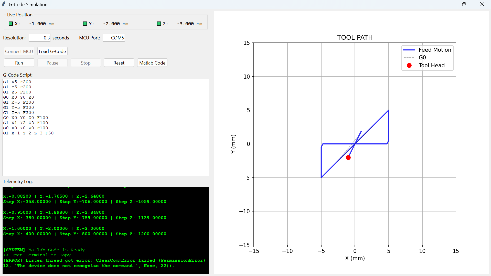
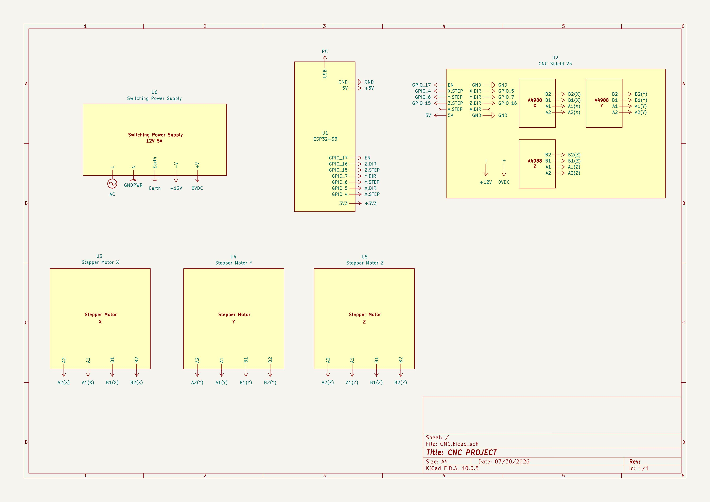
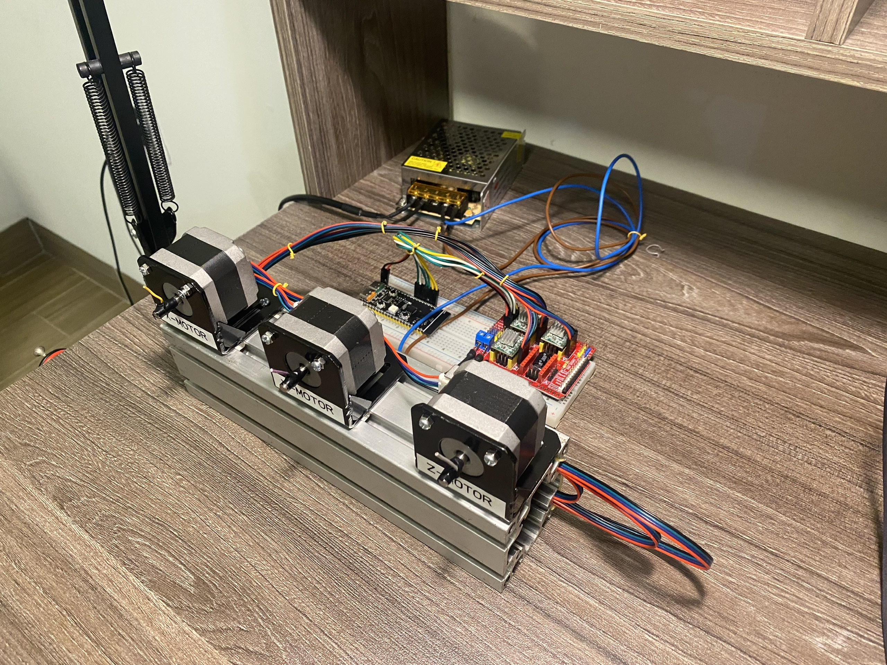

# 🖥️ ESP32-S3 Multi-Axis Stepper Motor Controller & Real-Time GUI Interface

An open-loop, real-time multi-axis CNC stepper motor controller and telemetry visualization interface developed at **Ho Chi Minh City University of Technology (HCMUT)**. The system utilizes a dual-core **ESP32-S3** microcontroller to execute deterministic synchronized step pulses via **Bresenham's algorithm** and streams real-time toolhead telemetry over UART to a host PC GUI.

---

## 🎬 Video Demonstration

---

## 📸 System Overview & Visuals

### 1. Software GUI Interface

*Figure 1: Host PC Graphical User Interface (GUI) for G-code execution and real-time toolhead position tracking.*

### 2. Hardware Schematic Circuit Diagram

*Figure 2: Complete electronic schematic diagram featuring ESP32-S3, CNC Shield V3, A4988 drivers, and 12V 5A power supply.*

### 3. Physical Model & Hardware Setup

*Figure 3: Fully assembled physical experimental hardware platform with Nema 17 stepper motors and CNC Shield V3.*

---

## ✨ Key Features & System Architecture

### 1. Dual-Core Firmware Architecture (ESP32-S3)
* **Core 0 (Dedicated Motion Engine):** Handles microsecond-accurate STEP pulse timing, Direction toggling, and trapezoidal acceleration profiles without interruption.
* **Core 1 (Communication & Kinematics Engine):** Manages high-speed UART Serial communications, parses incoming host GUI commands, performs step-to-mm coordinate quantization, and packages telemetry.

### 2. Synchronized Multi-Axis Interpolation (Bresenham's Algorithm)
* Calculates integer error accumulators (`error_x`, `error_y`, `error_z`) based on the dominant axis (`MAX_STEP = max(DX, DY, DZ)`).
* Guarantees perfectly synchronized linear motion across 3 axes ($X, Y, Z$) simultaneously using discrete step increments.

### 3. Real-Time Telemetry & Coordinate Quantization

* **Resolution / Scale:** Converts step counts to physical displacement using lead screw kinematics:
  $$\text{Resolution} = \frac{(1.8^\circ / 360^\circ) \times 16 \text{ microsteps}}{8 \text{ mm/rev}} = 400 \text{ steps/mm}$$
* **Quantized Position Formula:** $\text{Position (mm)} = \frac{\text{Accumulated Steps}}{400 \text{ steps/mm}}$
* **UART Telemetry Stream:** Transmits packed ASCII status frames (e.g., `<POS: 1, +12.345, -50.200, +3.100, IDLE><STEP: 1600.000, 3200.000, 400.000>`).

### 4. Trapezoidal Acceleration & Deceleration Profiling

To prevent step skipping/loss during rapid speed transitions, the pulse generator implements a **Trapezoidal Move Profile**:

* **Ramp-up Stage** ($\text{STEP} < \text{RAMP}_{\text{STEP}}$):
  $$\text{DELAY} = \text{START}_{\text{DELAY}} - \left((\text{START}_{\text{DELAY}} - \text{TARGET}_{\text{DELAY}}) \times \frac{\text{STEP}}{\text{RAMP}_{\text{STEP}}}\right)$$

* **Cruise Stage** ($\text{RAMP}_{\text{STEP}} \le \text{STEP} < \text{MAX}_{\text{STEP}} - \text{RAMP}_{\text{STEP}}$): Constant velocity at $\text{TARGET}_{\text{DELAY}}$.

* **Ramp-down Stage** ($\text{STEP} \ge \text{MAX}_{\text{STEP}} - \text{RAMP}_{\text{STEP}}$):
  $$\text{DELAY} = \text{START}_{\text{DELAY}} - \left((\text{START}_{\text{DELAY}} - \text{TARGET}_{\text{DELAY}}) \times \frac{\text{REM}_{\text{STEP}}}{\text{RAMP}_{\text{STEP}}}\right)$$

* **Configured Thresholds:** $\text{START}_{\text{DELAY}} = 1200\ \mu\text{s}$, with default Feedrates of $1500\text{ mm/min}$ (Rapid G0) and $300\text{ mm/min}$ (Cutting G1).

## 🛠️ Hardware Specifications & Component Bill

| # | Component / Hardware Module | Quantity | Specifications & Role |
|---|-----------------------------|----------|--------------------------------------------------|
| 1 | **Host PC** | 1 | Executes Python/PyQt GUI for command input and monitoring |
| 2 | **ESP32-S3 MCU Board** | 1 | WeAct ESP32-S3-B N16R8 (Dual-Core, 16MB Flash, 8MB PSRAM) |
| 3 | **CNC Shield V3** | 1 | Expansion board providing socket interfacing for 4 driver modules |
| 4 | **A4988 Stepper Drivers** | 3 | Bipolar motor drivers with adjustable microstepping (up to 1/16) |
| 5 | **Nema 17 Stepper Motors** | 3 | 42mm bipolar stepper motors (1.8° step angle, 200 steps/rev) |
| 6 | **Switching Power Supply**| 1 | 12V 5A DC power supply powering CNC Shield V3 and drivers |

---

## 📡 Communication Protocol & Bandwidth Optimization

* **Handshake Protocol:** Host GUI sends a `PING` byte upon connection; ESP32-S3 verifies serial readiness and responds with `PONG`.
* **Serial Configuration:** 115200 Baud Rate over USB-UART connection.
* **Bandwidth Threshold Calculation:**
  * Maximum payload capacity at 115200 baud $\approx 11.52 \text{ KB/s}$.
  * Average telemetry packet size $\approx 80 \text{ bytes } (0.08 \text{ KB})$.
  * Minimum update interval ($t$) constraint:
    $$0.08 \text{ KB} \times \frac{1}{t} \le 11.52 \text{ KB/s} \implies t \ge \frac{0.08}{11.52} \approx 0.0069 \text{ s} \approx 10 \text{ ms}$$
  * Set **Resolution Time ($t$) Limit:** $\ge 10 \text{ ms}$ (100 Hz update limit) to guarantee serial stability without buffer overflows.

---

## 📜 Supported G-Code Commands

| Command | Category | Description | Default Parameter |
|---------|----------|-------------|-------------------|
| `G0` / `G00` | Motion | Rapid linear positioning (non-cutting motion) | Feedrate: $1500 \text{ mm/min}$ |
| `G1` / `G01` | Motion | Linear interpolation cutting motion | Feedrate: $300 \text{ mm/min}$ |
| `G90` | Mode | Absolute positioning mode | Active by default |
| `G91` | Mode | Incremental / Relative positioning mode | Optional toggle |

---

## ⚠️ Known Limitations & Scope

* **Open-Loop Control:** Operating without encoder feedback; toolhead position relies on quantized step accumulation.
* **Interactive Control Hardware Limitations:** Pause and Stop hardware interrupt triggers are currently disabled in firmware revision.
* **Serial Throughput Bound:** Visual refresh rate is constrained to $\ge 10 \text{ ms}$ sample resolution due to 115200 baud rate UART bandwidth ceiling.
